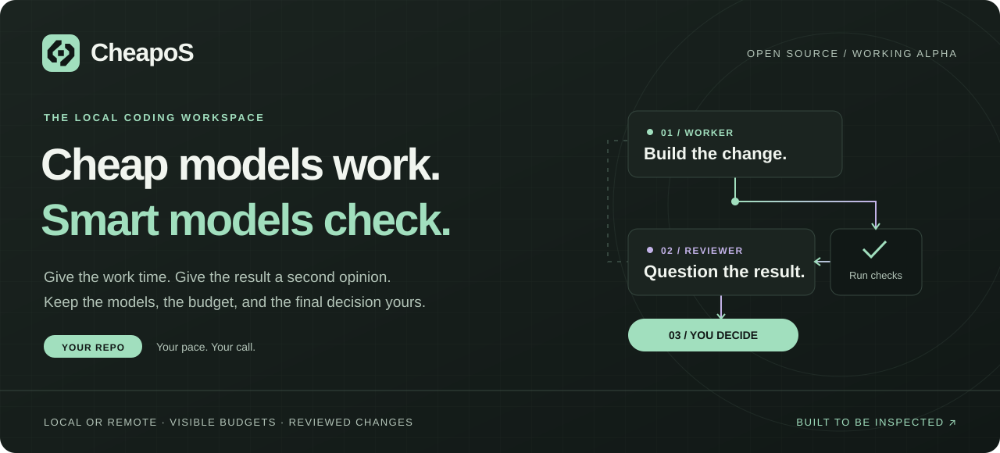
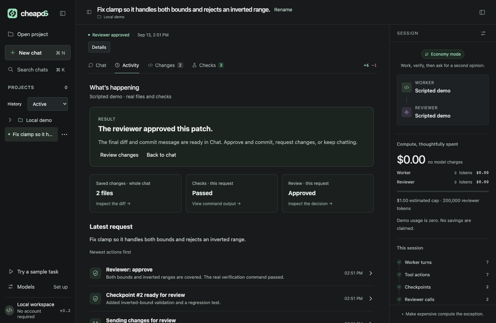
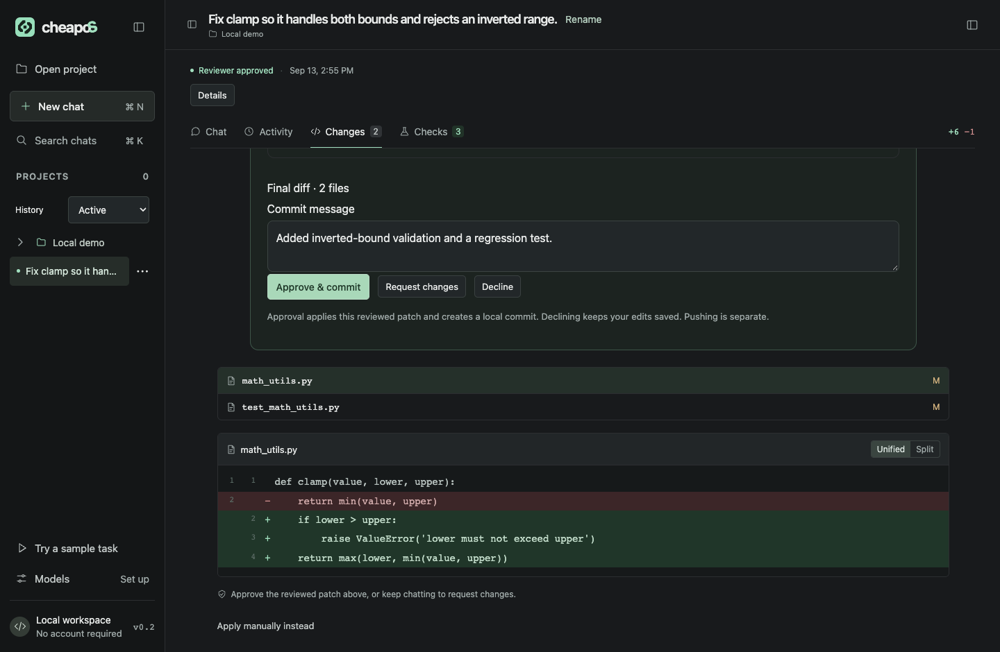
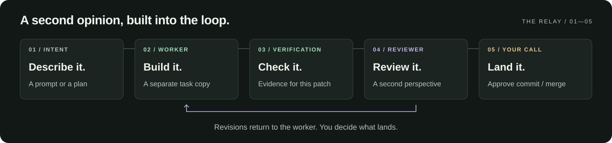
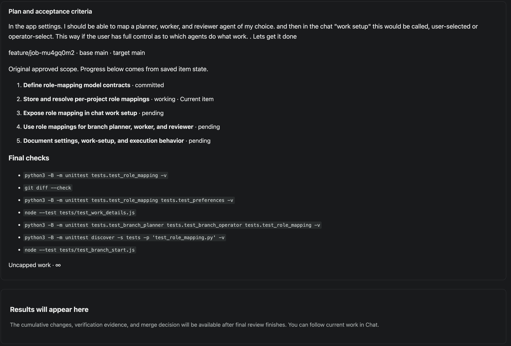
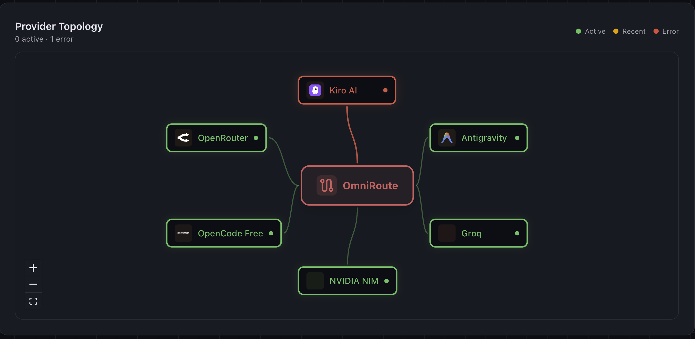

<div align="center">
  <a href="#quick-start"></a>
  <br><br>
  <a href="#quick-start"><strong>Get started</strong></a> &nbsp; · &nbsp;
  <a href="#the-workspace">See the workspace</a> &nbsp; · &nbsp;
  <a href="#why-cheapos-exists">The idea</a> &nbsp; · &nbsp;
  <a href="docs/USER_GUIDE.md">Documentation</a> &nbsp; · &nbsp;
  <a href="CONTRIBUTING.md">Contribute</a>
  <br><br>
  <strong>Working alpha</strong> &nbsp; / &nbsp; Python 3.9+ &nbsp; / &nbsp; macOS &amp; Linux &nbsp; / &nbsp; <a href="LICENSE">MIT</a>
</div>

# CheapoS

**Your ideas should matter more than your budget.**

CheapoS is an open-source coding workspace that lets an inexpensive model implement a change, runs real checks, and brings in a reviewer at checkpoints. Work on local Git projects, choose your models, set your limits, and inspect the result before it lands.

No CheapoS account. No hosted project. No required package installation to launch the app. Just Python, Git, and your browser. (CheapoS itself needs no install. We recommend [OmniRoute](docs/USER_GUIDE.md#omniroute-companion) as the main app for connecting and managing model providers.)

> **Available today:** a working local alpha for small personal projects. Model providers may require their own setup or credentials. Cost savings are an experiment to measure; they are not yet a benchmark claim.

## The workspace



<p align="center"><sub>The real app, running its built-in demo. Model responses are scripted; file edits, tests, and the exported Git patch are real. No inference charges.</sub></p>

<details>
<summary><strong>Look closer at the patch and final decision</strong></summary>



The same scripted demo, in **Changes**. Inspect the patch, edit the commit message, and choose whether to approve it.

</details>

## Features

Make expensive compute the exception. Keep the work visible and the decisions yours.

<!-- FEATURE GRID: Duplicate one td (and add a tr after every two cards). Keep the outcome, mechanism, and guide link together. -->
<table>
<tr>
<td width="50%" valign="top">
<h3>01 · Give every change a second look</h3>
<p>Choose a worker and a reviewer separately. Review checkpoints include the actual patch, check results, and read-only project tools. Reviewers can approve, request revisions, or propose a takeover.</p>
<a href="docs/USER_GUIDE.md#open-a-project-and-chat">Explore the review loop →</a>
</td>
<td width="50%" valign="top">
<h3>02 · Run where it makes sense</h3>
<p>Keep everything local, use free remote models, delegate heavy work from a local conversation, or select your own model pair. Remote models connect through OmniRoute during development. Installed local Ollama models can also connect directly.</p>
<a href="docs/EXECUTION.md">Choose your execution setup →</a>
</td>
</tr>
<tr>
<td width="50%" valign="top">
<h3>03 · Set a job in motion</h3>
<p>Turn a prompt or project document into a bounded unattended plan. Authorize the proposal once; CheapoS implements, checks, reviews, and commits its items to a feature branch. You decide the final local merge.</p>
<a href="docs/unattended-runs.md">Meet unattended runs →</a>
</td>
<td width="50%" valign="top">
<h3>04 · See where the budget goes</h3>
<p>Track worker and reviewer usage, estimated cost, and uncertain requests. Set dollar, token, turn, iteration, and time limits. Automatic remote runs show named model handoffs when a free route fails.</p>
<a href="docs/USER_GUIDE.md#limits-and-recovery">Inspect limits and recovery →</a>
</td>
</tr>
<tr>
<td width="50%" valign="top">
<h3>05 · Keep the evidence close</h3>
<p>Chat, Activity, Changes, and Checks put the conversation beside saved edits and verification results. Passing check evidence is reused only while its patch, command, and environment identity still match.</p>
<a href="docs/EXECUTION.md#activity-shows-evidence">See what actually happened →</a>
</td>
<td width="50%" valign="top">
<h3>06 · Pick up where you left off</h3>
<p>Task copies, conversations, patches, reviews, and accounting persist locally. Pause, resume, follow up in the same chat, export a patch, or reconcile saved edits when the source project moves ahead.</p>
<a href="docs/USER_GUIDE.md#open-a-project-and-chat">Keep work moving →</a>
</td>
</tr>
</table>

<details>
<summary><strong>Explore the full feature set</strong></summary>

- **Real project tools:** file outlines, numbered reads, local search, edits, diffs, and approved verification commands.
- **Public-link reading:** ask about an HTTPS page or GitHub README and see the source and lines the model read.
- **Visible progress:** streaming output and expandable reasoning for supported Ollama and OmniRoute connections.
- **An adaptable workspace:** resizable panels, keyboard controls, chat search, editable task titles, pinned tasks, archive, and restorable Trash. Hide or reopen a project without deleting its files.
- **Explicit permissions:** allow a check once or for the session; inspect and revoke remembered grants.
- **A gentle first run:** discover eligible installed local models, use guided OmniRoute setup, or try the scripted demo without connecting a provider.
- **Project context that carries forward:** a compact project brief and durable continuation record retain requirements, steering, file observations, and verification evidence.
- **Small edits before trouble starts:** large files and tight output allowances trigger focused edits; stale file versions are rejected and refreshed.
- **Model selection informed by outcomes:** automatic free routes use observed role compatibility, checkpoint completions, and failures while keeping availability and human acceptance separate.
- **Less repeated approval:** authorize supported project unittest variants for a session, with visible scope and revocation.
- **Simple time and spending controls:** choose Free only or an explicit budget, use a working-time preset, and adjust advanced limits when needed.
- **Bounded recovery:** recover from check failures and reviewer revisions, wait cancelably for a free route, and pause with a specific next action when limits or prerequisites block progress.
- **Environment readiness:** detect missing verification tools or a selected virtual environment, show the task-copy location, and recheck after manual setup.
- **Inspectable task metrics:** separate model time, cooldowns, approval waits, usage provenance, and completion outcomes; export local reports without prompts or credentials.
- **Optional output filtering:** opt in to concise unittest output on supported direct local connections while retaining original check output for inspection. [Read the experiment](docs/experiments/output-filtering.md).
- **A real sample task:** try your selected models on a disposable repository with bounded time and spending.

[Read the complete user guide →](docs/USER_GUIDE.md)

</details>

## From a request to a reviewed change



**Interactive:** the worker makes the requested change, runs appropriate checks, and submits it to the reviewer. Approve a verification command when prompted; after review passes, inspect the diff and choose **Approve & commit**. You can ask for changes before committing. **Finish review** resumes verification and review of saved edits directly, reusing checks that still match the patch and command. Follow-ups keep the same task copy and history.

**Unattended:** inspect a finite plan and choose **Start run**. Reviewed items become feature-branch commits within the authorized scope and cumulative limits. The completed branch comes back for your explicit merge decision. The local server must stay running.

Automatic remote selection uses different worker and reviewer model IDs. All local and manual setups can use the same model in separate requests; that is not an independent model review. Unattended runs require a distinct reviewer.

**Follow the plan as it happens.** The **Plan** tab keeps the approved scope, item progress, and planned verification commands together. **Changes** is the review workspace in both modes: inspect an interactive patch before committing, or the cumulative unattended diff and saved review evidence before merging. Every **Review changes** action opens Changes.



*A live unattended run working on cheapoS itself. The first item is committed to the feature branch; the run is still in progress. The listed commands are planned checks, not passing results.*

## Quick start

Requires **Python 3.9+** and **Git**. Development and verification target **macOS and Linux**. No Python or JavaScript packages are required to run CheapoS.

```sh
git clone https://github.com/carlosa8c/CheapOS.git
cd CheapOS
python3 run.py
```

The app opens at **http://127.0.0.1:5173/**. On macOS, you can also double-click **Start CheapOS.command**.

**Start with the demo:** choose **Try a sample task → Run scripted demonstration**. Watch a failing test become a corrected implementation, a reviewer request a regression test, and the final patch pass review. No model setup needed.

**Start with your project:** connect models, open a local Git repository, and describe your task. New chats default to a $0 estimated spending cap; explicitly change it before choosing paid models. Startup can make a bounded greeting request to an eligible installed local model; free-cloud startup is opt-in.

<details>
<summary><strong>Launch options and task storage</strong></summary>

```sh
python3 run.py --no-open
python3 run.py --port 5174
python3 run.py --data-dir /path/to/local-task-storage
```

Task data defaults to `.cheapos/` beside the launcher. When asking CheapoS to work on its own repository, use `--data-dir` with a location outside that repository. Task storage must not overlap the project being edited.

[Setup and startup behavior →](docs/USER_GUIDE.md#run-locally)

</details>

## Your models. Your mix.

**CheapoS decides why and when to spend intelligence. OmniRoute decides where to get it.**

| Connection | What it gives you | Get connected |
| :--- | :--- | :--- |
| **OmniRoute** | A first-class local gateway, provider management, model discovery, and eligible free-model routing. | [Companion setup](docs/USER_GUIDE.md#omniroute-companion) |
| **OpenRouter and other remote providers** | Configure providers in OmniRoute, then choose their gateway model IDs in cheapoS. Direct remote connections are disabled during development. | [Companion setup](docs/USER_GUIDE.md#omniroute-companion) |
| **Ollama** | Installed tool-capable models running on your own hardware; use directly or through OmniRoute. | [Local setup](docs/USER_GUIDE.md#local-setup-and-sample-tasks) |

### Recommended starter setup

Use **OmniRoute as your remote gateway**, with several connected providers so cheapoS has alternatives when a route is unavailable or cooling down. The setup below includes **OpenRouter, OpenCode Free, Groq, NVIDIA NIM, Antigravity, and Kiro AI**. Connect the providers you have access to; you do not need every provider pictured to get started. Aim for two available, tool-capable models for the worker and independent reviewer, preferably across different providers.



*A live OmniRoute session. Kiro AI had reached its quota when this was captured—one reason to connect several providers.*

[Connect OmniRoute and choose your models →](docs/USER_GUIDE.md#omniroute-companion)

**Recommended for OpenRouter free-model use:** buy at least **$10 in OpenRouter credits** to raise the free-model allowance from **50 to 1,000 requests per day**. You **do not need to spend those credits** on inference to qualify. This optional purchase also helps when accessing OpenRouter through OmniRoute. [OpenRouter's policy](https://openrouter.ai/docs/faq) · [Setup details](docs/USER_GUIDE.md#openrouter-free-request-allowance)

Protect that balance with a **dedicated OpenRouter key for OmniRoute**, an explicit provider-side spending cap, and free-only model choices. A positive key cap permits spending up to that allowance; it does not make a paid route free. [Protect your credits](docs/USER_GUIDE.md#protect-the-credits-you-keep)

Provider access, availability, and costs depend on your configuration. A free-model filter or estimated $0 cap does not override gateway fallbacks or establish a provider billing limit.

## Built in the open. Measured in the open.

The current evidence includes a **completed live delegation loop**: a local Gemma coordinator handed off a small Python fix to a free remote worker, tests passed, and a different free reviewer approved the patch in **30.73 seconds**. It was one small fixture, with $0.00 accounted using configured prices—not a provider billing receipt or a savings benchmark. [Read the experiment and its limits →](docs/experiments/2026-09-13-delegation.md)

The implementation is documented feature by feature: [**workspace, permissions, onboarding, recovery, context, and model selection**](TASKS.md) · [**planning, feature-branch commits, final review, and local merge**](BRANCH_RUNS.md). Each card records its scope and validation. [Task metrics](docs/development/task-metrics.md) and [optimization experiments](docs/experiments/context-compression.md) make the underlying measurements inspectable.

**Know the boundaries:** checks execute project code on your computer; a separate task copy is not an operating-system sandbox. Remote models receive the context sent to them. Budget caps are estimates. One task runs at a time, and dependencies are prepared manually. Read the [user guide](docs/USER_GUIDE.md) and [security notes](SECURITY.md) before using an unfamiliar repository.

## Why CheapoS exists

> “I’d happily trade speed for more usage.”
>
> — [Irushi (@Im_IrushiK), in the X post that inspired this project](https://x.com/Im_IrushiK/status/2098809262302720347)

The post imagined a slower coding mode: give a task more time, let it work while you are away, and make a limited compute budget go further. That question started CheapoS.

Our experiment is to give inexpensive models the implementation work and spend stronger-model attention at review checkpoints. The aim is useful, reviewed changes at a cost worth waiting for. The alpha makes that workflow tangible; the next step is measuring when the trade actually pays off.

## Build with us

For fast development checks, run `python3 -B scripts/check.py --plan` to preview
what your changes need, then run it without `--plan`. Add `--base main` to include
committed branch changes. See [validation guidance](CONTRIBUTING.md#fast-iteration-is-the-default).

Try a small task. Share a reproducible failure. Help measure which model pairs produce a correct patch at a sensible cost.

- [**Contribute**](CONTRIBUTING.md) — development setup, focused checks, and project principles.
- [**Report an issue**](https://github.com/carlosa8c/CheapOS/issues) — bugs, model compatibility, and feature ideas.
- [**Read the docs**](docs/USER_GUIDE.md) — setup, project workflows, permissions, and recovery.
- [**Explore the engine**](docs/USER_GUIDE.md#development) — source map and development commands.
- [**Extend this presentation**](docs/presentation/README.md) — theme tokens, SVG templates, and feature-block recipes.

---

<p align="center">
  <br>
  <strong>Take your time. Keep your change.</strong><br>
  <sub>CheapoS · Local-first · Open source · <a href="LICENSE">MIT licensed</a></sub>
</p>

### Limits & recovery

Settings → **Limits & recovery** separates cumulative work budgets from spending
and per-request capacity. Choose this chat, optional project overrides, or app
defaults for future chats. Existing saved limits stay intact. See the
[limits guide](docs/development/limits-and-recovery-user-guide.md) for No cap,
Automatic, and applying a budget change without resetting usage.
