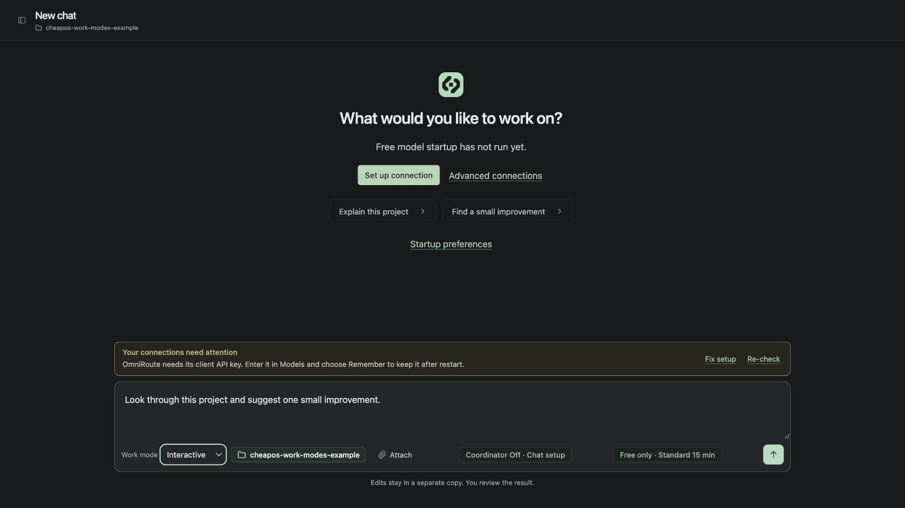

# CheapoS user guide

[← Back to the project](../README.md) · [Execution](EXECUTION.md) · [Unattended runs](unattended-runs.md)

**Cheap models work. Smart models check.**

CheapoS is an open-source, local coding workspace experimenting with a simple trade: give an inexpensive model time to implement a change, then ask a stronger model to review the evidence at checkpoints.

**CheapoS decides why and when to spend intelligence. OmniRoute decides where to get it.** CheapoS owns task execution, verification, review checkpoints, and budget accounting. Its optional OmniRoute companion owns provider access and routing. Automatic remote chats maintain a pool of free candidates and visibly hand off failed requests; manual and local model choices stay fixed.

This is an early, working alpha for personal projects. It has real repository tools and an execution engine. The recommended public-alpha installation runs from source as a local server; [macOS desktop builds are experimental](../README.md#experimental-macos-builds). No account or hosted project requirement. Cost savings are a hypothesis to measure, not a benchmark claim.

## Run locally

Requires **Python 3.9+** and **Git**. No Python or JavaScript packages need installing. Development and verification currently target macOS and Linux.

```sh
git clone https://github.com/cheapos/CheapoS.git
cd CheapoS
python3 run.py
```

On macOS, you can also double-click **Start CheapOS.command**. The app opens at **http://127.0.0.1:5173/**. It binds only to the loopback interface. Local coding needs no sign-in or cloud deployment. Usage stays local by default; optional Club sharing is described in [Security](../SECURITY.md#optional-club-sharing).

```sh
python3 run.py --no-open
python3 run.py --port 5174
python3 run.py --data-dir /path/to/local-task-storage
```

On launch, CheapoS looks for a free worker and asks it to say hello. Installed local Ollama models with advertised tool support work without a key or a setup form. A saved eligible model takes priority; otherwise, already-loaded local models are preferred. If no local model works, **Use free cloud models** opts into configured free routes through OmniRoute. CheapoS never enrolls providers, downloads models, or falls back to a paid model.

The welcome message is real inference with no project context or tools. One startup check tries at most three distinct candidates, with a 512-token output cap per request (128 for direct Ollama, with thinking disabled for this greeting only), a 30-second network timeout, and a 60-second stream limit checked between chunks. Reloading the page does not repeat it. **Startup preferences** controls automatic connection and free-cloud fallback; **Stop connecting** cancels it. The greeting verifies chat and token reporting, not completion of the coding loop.

An existing reviewer is preserved. On a fresh setup, the same free model fills both roles, with a separate reviewer request at checkpoints; change either role in **Models** later. A saved paid model or automatic combo is not used for a startup greeting. Startup preferences live in `.cheapos/startup.json`, and the latest check and usage in `.cheapos/startup-last.json`.

You can also click **Try the local demo**. It creates a tiny Python repository, reproduces a failing test, edits the implementation, requests a revision, adds a regression test, and exports a real Git patch. Model decisions are scripted and clearly labeled. No provider requests or charges occur.

## Arrange your workspace

Drag either panel’s inner boundary to resize it. Drag toward the outer window edge
to hide it; use the panel buttons in the top bar to reopen it at its remembered
width. Desktop widths are capped at 28.5% for the sidebar and 25% for session
details. Narrow screens use one overlay panel at a time. Widths and visibility
are saved in this browser. Keyboard users can focus a divider and use arrow keys
to resize, Home to hide, or End to maximize.

<a id="choose-how-to-supervise-work"></a>

## Work modes

Use **Work mode** below the message box to choose how you collaborate with cheapoS.



*The real app with a disposable sample project. Choose the mode before sending your new task; switching the selector does not start work.*

### Interactive — Work with me

Use Interactive for questions, brainstorming, debugging, or changes you want to steer as you go. It is the default for a new chat. You can simply talk: a question can finish with an answer and needs no code review. When you request code changes, cheapoS works in a separate task copy, runs authorized checks, and requests model review. Inspect **Changes** and choose **Approve & commit** when you want the reviewed patch applied to your project. You approve each commit; you can keep chatting before or after it.

Example: “Explain how login works. Let's discuss ways to simplify it before changing anything.”

### Unattended — Take it from here

Use Unattended for a defined job you want agents to carry through, such as implementing a feature from a specification. Send a prompt, a project document, or both to prepare a proposal. **Send begins planning, not implementation.** Inspect **Review & start**, including the scope, checks, permissions, and limits, then choose **Start run**.

cheapoS implements the approved items, runs checks, obtains independent review, and commits reviewed steps to the task's feature branch. It returns the completed work to **Changes**, where you decide whether to **Approve & merge locally**. You approve the plan and the final merge, rather than every item commit. If an essential decision or additional permission is needed, the run can still ask you.

Example: “Add CSV export to the reports page, test it, and document the new option.”

### Change the mode

1. Open a local Git project and choose **New chat**.
2. Below the message box, open **Work mode** and choose **Interactive** or **Unattended**.
3. Enter your request and send it. Unattended prepares a proposal for your approval first.

An authorized unattended run keeps its mode, so its selector is disabled. Use **Pause** or **Resume** for that run; start a new chat for a different workflow. A saved unsent draft can retain its previous mode, so check the selector before sending.

### What stays the same

- **Chat stays available.** Ask questions or add guidance in either mode. Guidance during an unattended run stays within its approved plan; **Request changes** starts a reviewed revision.
- **Code changes still need checks and review.** Conversational answers do not themselves approve saved edits. Both modes use **Changes** for your final review.
- **Your permissions and limits still apply.** Mode is separate from model placement, command authorization, and the work/spending budget. Unattended does not mean uncapped. For unattended setup and diagnostics, review **Allow task commands** on **Review & start**; only enable it for a project you trust.
- **Work runs on your computer.** Keep the computer awake and cheapoS running for execution to continue. Closing or stopping the server does not leave a hosted agent working elsewhere.
- **You decide what lands.** Interactive asks before each commit to your project; Unattended asks before its final local merge. Neither automatically pushes to a remote repository.

See [the unattended walkthrough](unattended-runs.md) for document inputs, proposal editing, and integration details.

## Choose where work runs

Use the execution button beside the chat spending limit to choose **Delegate heavy work**, **All local**, **All remote**, or **Manual model pair**. Local chat can delegate project work to free OmniRoute models and go idle. Automatic remote selection checks tool support and chooses a different reviewer. Existing chats keep their saved setup.

The **Activity** tab shows current status, saved file changes, checks, review decisions, and named model handoffs. Runs pause at progress limits instead of indefinitely rereading files. See [execution choices, free routing, and progress limits](EXECUTION.md).

## Connect models

Open **Models**. OmniRoute is the first-class local gateway, with separate model choices for the worker and reviewer. All remote model requests must use the configured local OmniRoute gateway during development. Direct Ollama remains available for installed local models.

### OmniRoute companion

For cooldown retry ownership and an explanation of reported versus reserved
tokens, see [request pacing and token accounting](development/request-accounting.md).

Use **Set up connection** on the welcome screen for guided setup. It reuses an identified gateway, explains missing prerequisites, and re-checks while the dialog is open. Install and provider login steps stay in your terminal and OmniRoute dashboard. **Use this connection** opens project selection; project work starts only after you send a request. Existing explicit model pairs are preserved.

Install OmniRoute with these two simple commands:

```sh
npm install -g omniroute
omniroute
```

This boots the local gateway on `localhost:20128` with zero‑config keyless operation. CheapoS uses your installed `omniroute` command and existing provider configuration; it does not bundle, install, or update it. The integration was checked against OmniRoute 3.8.49.

On launch, CheapoS checks `http://127.0.0.1:20128/v1/models`. It reuses an identified OmniRoute instance or starts the installed CLI on loopback when **Start installed OmniRoute when CheapoS launches** is enabled (the default). Startup runs in the background, so your local task history and patches stay accessible if the gateway fails. An occupied port or rejected client key does not trigger another server.

The new-chat composer shows connection problems before you send a task, including a missing gateway key or an unavailable saved Ollama model. **Fix setup** opens connection settings; **Re-check** reads fresh metadata. These checks run even when startup greetings are disabled and do not run inference, load a model, or download anything. Metadata availability does not prove tool compatibility, remaining quota, or a successful coding loop.

Your selected local model and reviewer are remembered in the app’s data directory. Switching work modes or changing limits keeps those model choices; an unavailable model does not erase them. Discovery prioritizes your saved selection when inspecting installed Ollama models.

1. In **Models**, use **Open OmniRoute** to manage providers and their credentials.
2. Use **Connect / start** or **Refresh models** to load the catalog. If required, enter a gateway client API key under **Startup & connection settings**; this is separate from the dashboard password.
3. Choose **OmniRoute (shared local gateway)** for each role, then pick an explicit model. The picker shows advertised tool support and context size. Catalog access does not prove that a model can complete a task.
4. For free tests, leave **Show free models only** checked and choose explicit OpenRouter `:free` variants for both roles. Unknown prices stay blank and must be supplied. New chats default to a zero-dollar cap. Change the cap explicitly before using paid models.
5. Save the connections, open a project, and send a message.

The free pool refreshes every five minutes. For a connected OpenRouter provider, CheapoS checks its public catalog for current named free models and tool support. Provider cooldowns respect OmniRoute's retry time without marking every model as broken. Delegate and All remote chats can replace a failing model with another named free model, with at most two handoffs per run. Manual and All local chats keep their models. Startup connection checks can try other eligible free candidates before a chat begins. The free filter is not a gateway billing control: check OmniRoute's own retries, combos, and fallback policies. `auto/cheap` and a zero dollar cap do not guarantee provider-side billing limits.

OmniRoute also supports Ollama, allowing a local worker and a remote reviewer through the same gateway. Configure the local provider in OmniRoute, then refresh the catalog in CheapoS. If the catalog omits prices, disable the free-model filter to find it and enter zero prices only for a model actually running locally. A direct Ollama connection is also available below. Local inference depends on your hardware and the model’s tool support. A local `gemma4:31b` connection has been checked with real file reads, a project question, and a follow-up in the same chat. That check verified conversational use. A later [31-second live delegation experiment](experiments/2026-09-13-delegation.md) used Gemma for a short handoff, a free remote worker for edits, and a different free reviewer; verification passed and the reviewer approved the small patch.

**Keep OmniRoute running when CheapoS closes** is enabled by default, allowing other clients to keep using it. Disable it to stop a process started by the current CheapoS session on exit. CheapoS never stops an instance it merely reused. Startup preferences are saved in `gateway.json` in the app’s data directory (`.cheapos/` for the command-line default).

**Remember this key on this computer** saves the OmniRoute client API key in macOS Keychain, or Linux Secret Service when `secret-tool` is installed. It is selected by default when entering a new key on a supported computer. The saved key is restored when CheapoS restarts with the same data directory and gateway URL. Only the remember preference goes into `gateway.json`; the key never goes into project files, task history, or browser storage. On computers without supported secure storage, use a session-only key or `CHEAPOS_GATEWAY_API_KEY` in the launch environment. CheapoS does not install a credential service or fall back to plaintext storage.

Under **Models → Startup & connection settings**, the status distinguishes saved, session-only, and environment keys. Uncheck **Remember** and save to remove the stored key while keeping it for the current session; **Forget client key** removes both the stored key and the in-memory value. Changing the gateway URL clears the old key and its included-model authorization. A locked credential store shows a recovery message: unlock it and refresh, or supply a launch-environment key. A launch-environment key takes precedence on startup and is never automatically copied into the credential store; forgetting a key does not modify your launch environment.

### Direct connections

Only **local Ollama** is available directly: `http://127.0.0.1:11434/v1`, with an installed model supporting tool calling. Local model prices can be zero. cheapoS verifies the installed model before task inference, including Manual mode; Ollama cloud routes must use OmniRoute instead.

**Direct OpenRouter and other remote endpoints are disabled during development.** Configure their credentials and models inside OmniRoute, then select **OmniRoute (shared local gateway)** for worker, reviewer, and planner. The server enforces this for saved tasks, overrides, model discovery, and startup greetings. It does not silently rewrite an old task's endpoint: saved edits remain available, and blocked settings explain how to start a new chat with gateway models.

Only the OmniRoute client key is accepted in cheapoS, under gateway settings or through `CHEAPOS_GATEWAY_API_KEY`. Direct role keys (`CHEAPOS_WORKER_API_KEY`, `CHEAPOS_REVIEWER_API_KEY`, and `CHEAPOS_PLANNER_API_KEY`) no longer authorize inference and are not forwarded to local Ollama. cheapoS does not load `.env` files automatically.

The public OpenRouter model catalog is still read without credentials to retire stale free model IDs; it is metadata, not an inference route. This restriction governs cheapoS model requests, not other applications or separately approved commands on the computer. OmniRoute can still use paid upstream models: model placement, included-access labels, and spending authorization are separate controls. Gateway-only routing does not itself prevent charges.

Saving settings and refreshing the catalog make no inference requests. The separate startup connection check makes the bounded greeting request described above. Automated tests cover the worker/reviewer workflow through local HTTP fixtures. The initial live free-model experiment reached passing checks but timed out at review. A later [small live delegation test](experiments/2026-09-13-delegation.md) completed edits, verification, and a separate reviewer approval. Cost savings and reliability on larger tasks remain unproven. A chat subscription does not automatically provide API credits.

References: [OmniRoute](https://github.com/diegosouzapw/OmniRoute), [OpenRouter tool calling](https://openrouter.ai/docs/guides/features/tool-calling), [OpenRouter limits](https://openrouter.ai/docs/api-reference/limits), [Ollama compatibility](https://docs.ollama.com/api/openai-compatibility).

### OpenRouter free-request allowance

For regular free-model use, we recommend **purchasing at least $10 in OpenRouter
credits and leaving them unspent**. Buying credits qualifies you for the larger
allowance; spending them on paid inference is not required. This is optional,
and applies to OpenRouter models accessed through OmniRoute.

| Total OpenRouter credits purchased (all time) | Free-model requests per day | Requests per minute |
| --- | --- | --- |
| Less than $10 | 50 | 20 |
| At least $10 | 1,000 | 20 |

These are account-level limits shared across OpenRouter `:free` models, not
1,000 requests per model or per API key. Worker, reviewer, and probe requests
consume the allowance; one CheapOS task can make many requests. Upstream
availability and rate limits still apply. [OpenRouter limits](https://openrouter.ai/docs/api_reference/limits)

Keep using explicit `:free` variants for both roles and the $0 task cap; review
OmniRoute's fallback settings so paid routes do not consume the purchased credits.
OpenRouter charges a credit-purchase fee, so the checkout total may exceed $10.
Policy checked September 14, 2026; check the current
[OpenRouter FAQ](https://openrouter.ai/docs/faq) before purchasing.

### Protect the credits you keep

1. Create a **dedicated OpenRouter inference key for OmniRoute**. Enter it in OmniRoute's OpenRouter provider settings. The client key entered in cheapoS is a different credential; limiting that client key alone does not set the OpenRouter key's budget.
2. Set an explicit spending cap on the **OpenRouter key**, chosen by you. Prefer **no reset** for a development allowance unless you deliberately want it renewed. OpenRouter supports USD limits and optional daily, weekly, or monthly resets. A $0.10 or $0.25 cap still allows paid usage; it is not a free-only setting. [OpenRouter key settings](https://openrouter.ai/docs/api/api-reference/api-keys/create-keys)
3. Inspect that key's `limit`, `limit_remaining`, `limit_reset`, and usage in OpenRouter. A `null` limit means unlimited. Do not assume a zero key limit will preserve free-model access; that combination has not been qualified by cheapoS. [Credit limits](https://openrouter.ai/docs/api_reference/limits)
4. Keep explicit, currently free model IDs for the worker and reviewer, and the $0 cheapoS task cap when no spending is authorized. Inspect every gateway fallback target. An **included** label is your account-access declaration, not proof that OpenRouter won't bill the request.
5. Keep this provider key and any administrative credentials out of assistant prompts, repository files, and other agents' tool configurations. cheapoS's routing restriction cannot control a separate agent using its own credentials.

The existing one-cent automatic-route cutoff is checked against accounted usage after responses as well as before new requests. It cannot reverse a charge already incurred, and Manual mode uses its task budget. No setup step here increases either allowance. For the proposed stronger policy and the limits of automatic combos, see [Free routing and spending authorization](development/free-routing-policy.md).

## Open a project and chat

1. Click **Open project** and enter the root folder of a local Git repository. It is remembered on this computer; opening it makes no model request.
2. Type a question or describe a change, then send. CheapoS creates a separate task copy and uses your saved model choices and limits.
3. Questions can finish with an answer. For changes, the worker inspects the project, proposes a verification command, and asks for approval in the conversation. The controller requests a reviewer decision using passing checks for the current patch and command, running them first if needed.
4. Keep talking in the same chat. Follow-ups retain the task copy, current model pair, accumulated usage, and prior requests—even after a completed review. **New chat** starts a fresh copy of the source project.
5. After tests and model review finish, Chat presents the final diff and editable commit message. Choose **Approve & commit** to apply the reviewed patch and create its local commit, **Request changes** to keep working, or **Decline** to leave it saved without committing. You can keep chatting after reviewer approval; questions preserve the approval, while further edits need verification and review again. **Changes** also lets you inspect each file. **Checks** shows verification output. **Activity** summarizes current work and results; model accounting lives under **Details**.

In Interactive mode, your approval is required for each commit; a model's approval cannot authorize it. Approving does not call a model or rerun tests. The controller reuses its passing check only while the patch and command match; an explicit request to rerun tests still runs them. A worker's final response after editing automatically enters checkpoint review when a verification command is configured.

The preview expires after ten minutes; the patch and destination are rechecked before applying. Declining persists across restarts, and **Reopen decision** brings the same patch back without a new model review.

Your source checkout must be clean, on a branch, and have a configured Git author identity. The exact patch must apply cleanly; unrelated committed changes are preserved. Checks describe the task copy, while the preview identifies the current destination commit. Conflicts or unrelated uncommitted work stop the operation without discarding edits. Git hooks and signing are disabled for this action; repositories with content filters or sparse index flags use the exported patch workflow. A takeover can be committed after passing checks and your explicit review, with its lack of independent approval shown in the preview.

After committing, CheapoS confirms the result, asks what you want to work on next, and focuses the chat input. The chat advances its task baseline so follow-up changes create a new patch. The commit hash and original patch stay in history. An interrupted commit attempt is saved for an explicit retry, and a repeated request cannot create a duplicate commit. Pushing remains separate. **Export patch** is available for manual Git workflows.

If another chat or commit changed the same files, choose **Reconcile in this chat**. CheapoS creates a fresh task copy from the current project and merges the saved edits into it. The worker resolves any overlapping text, then runs checks and requests a new review before your next commit approval. The previous task copy and history stay saved, and the source project is untouched until you approve. Changes already present in the project need no duplicate commit.

The spending control below the message box edits the current chat's limits, or defaults for new chats. Saving limits does not run a model. Model settings apply to new chats. Automatic remote chats can replace failing models, with the reason and both model names visible in Chat. Manual and local chats retain their model choices.

Direct local Ollama connections on port `11434` and OmniRoute connections stream output into the conversation. Models that expose reasoning show an expandable **Thinking** panel while the answer appears separately as it arrives. A progress card shows elapsed time, the last completed action, and saved file changes. Thinking is model output, not evidence that a file was edited or a check passed. Completed and interrupted thinking previews are saved locally, capped at 16,000 characters per response; they are excluded from reviewer checkpoints. Endpoints that return ordinary JSON instead of a stream still work, with output shown on completion.

The reviewer can approve, request revisions, or request takeover. Takeover requires your explicit approval and uses the same remaining budget. Its final patch still needs your review. Plain answers and clarification questions do not count as reviewer approval; saved edits remain available in **Changes**.

### Read a public link

Paste an HTTPS link into Chat and ask about it. The worker and reviewer can use `read_url` to read public text pages; GitHub repository links open the repository's README through [GitHub's contents API](https://docs.github.com/en/rest/repos/contents#get-a-repository-readme). Chat shows the page being opened, the source, and the lines read. Longer documents can be read in sections. **Search project** searches local files only.

The reader can follow links returned by a page. It makes GET requests without cookies, credentials, or project contents, and blocks private/local addresses and redirects to them. Each run can fetch up to eight documents, with a 1 MB response limit and bounded text excerpts; repeated sections use an in-memory cache. It does not provide search-engine results, sign-in, JavaScript interaction, or PDF reading. If a page cannot be read, the worker should explain the error or ask for the relevant text. Retrieved text is untrusted source material, not permission to run commands.

The source checkout is not modified by file tools. From the original repository, inspect and apply the downloaded patch:

```sh
git apply --check /path/to/cheapos-TASK_ID.patch
git apply /path/to/cheapos-TASK_ID.patch
```

Snapshots omit common secret filenames, symlinks, dependency directories, and ignored files. This is not comprehensive secret detection. Inspect your repository before sending its contents to a remote provider.

By default, dependencies are not installed automatically without permission. The optional **Allow task commands** permission lets the worker run project setup (such as dependency installation) and diagnostic commands directly inside the task copy. Otherwise, you can pause the chat, find its copy under **Details → Workspace details**, prepare dependencies there yourself, then resume. Commands are split into arguments without a shell; pipes, shell expansion, and redirection are not interpreted.

**Verification runs repository code on your host computer. A separate copy is not an operating-system sandbox.** Commands require approval by default. Choose **Run once** or **Allow for this session** to remember an exact command for the current chat's task copy, including checkpoint reruns. Different commands still ask. Session grants expire when CheapoS restarts and can be cleared under **Details → Session permissions**. Legacy tasks may separately have a saved permission for their exact configured command. Use repositories you trust. New tasks default to a 360-second verification allowance; legacy tasks without a configured allowance retain 90 seconds. Checks have output limits; child processes are stopped as a group on macOS/Linux. Model API keys are removed from their environment.

## Limits and recovery

**Settings → Limits & recovery** defines defaults for new chats. **Chat setup**
shows and edits the selected chat's effective limits; changing defaults does not
silently rewrite existing work. Choose separate request, turn, tool-action,
review-token, iteration and working-time budgets, or **Uncapped work · ∞**.
Uncapped work removes cumulative work ceilings while keeping spending policy,
command permission, independent review and usage accounting. Older saved tasks
retain their captured policy until you explicitly change it.

Per-response capacity, request timeouts and verification deadlines are separate
from cumulative work budgets. **Automatic** uses available capacity and previous
operation evidence; finite provider/resource boundaries still apply. Model
metadata is not a billing guarantee. See [effective budget details](development/limits-and-recovery-user-guide.md).

- Requests reserve estimated usage before dispatch, then reconcile it with
  provider-reported usage. Uncertain requests retain their reservations; inspect
  **Token accounting** for the breakdown. Retries do not erase usage.
- Dollar caps are estimates. Use provider-side spending controls for a billing
  guarantee. A $0 task permits no reported charge; automatic free/included routing
  also stops at one cent of unexpected cumulative charges even with a higher cap.
- Automatic routes preserve saved work and try another eligible route after
  recoverable provider/model failures. Provider cooldowns apply before retrying;
  a pinned role does not silently switch to an unauthorized model.
- Invalid or incomplete tool calls do not execute. Repeated failures trigger
  focused guidance, available coordinator assistance or an authorized handoff.
  Recovery retains the current files, requirements, check evidence and attempt
  history. It cannot grant commands, raise spending, or approve its own work.
- **Pause** prevents further tool work. An in-flight provider operation can take
  time to cancel and may still report usage. **Resume** continues saved work;
  it does not recreate the task or reset its counters. Eligible saved route waits
  can resume automatically after restart within their original authority.
- Checks run in their captured task-relative directory. Missing setup can be
  repaired by the worker when task-command permission is enabled. Without that
  permission, additional command authority may be needed. Successful setup alone
  does not count as verification or independent review.

Unattended work commits reviewed items to its authorized feature branch. The final
local merge still requires your approval, and there is no automatic push. Use
**Changes** for the final diff in either mode. Large reviews are divided into
visible chunks; incomplete evidence is not an approval. Task copies and commands
are not an OS sandbox. Snapshot/resource limits still apply to very large projects.

Saved tasks live in your data directory: `.cheapos/` for a source installation,
`~/Library/Application Support/cheapoS` for a packaged Mac app, or your explicit
`--data-dir`. Back up that directory with the app stopped. Archive and restorable
Trash manage history in the app; emptying Trash permanently removes that saved work.
A process lock prevents two servers from using the same profile.

## Development

```sh
python3 -B scripts/check.py --plan
python3 -B scripts/check.py
# Before a release:
python3 -B scripts/check.py --full --jobs 4
```

Node is only needed for JavaScript development checks and tests. Tests use temporary local repositories and HTTP servers; they require no API keys and make no external inference calls.

| Path | Responsibility |
| --- | --- |
| `run.py` | Local launcher and single-process storage lock |
| `cheapos/server.py` | Loopback HTTP API, origin/token checks, static assets |
| `cheapos/engine.py` | Worker/checkpoint/reviewer state machine |
| `cheapos/workspace.py` | Repository copies, constrained file tools, verification |
| `cheapos/providers.py` | Chat Completions adapter and usage reservations |
| `cheapos/streaming.py` | Bounded streaming output and complete tool-call assembly |
| `cheapos/routing.py` | Execution placement, lightweight local delegation, and bounded free-route checks |
| `cheapos/model_pool.py` | Persistent model cooldowns and observed role compatibility |
| `cheapos/startup.py` | Free-worker discovery, startup greeting, and connection-check accounting |
| `cheapos/gateways.py` | Gateway interface, model discovery, and adapter selection |
| `cheapos/omniroute.py` | Optional local gateway startup, reuse, and process ownership |
| `cheapos/storage.py` | Atomic local task persistence |
| `dist/` | Dependency-free graphical workspace |
| `tests/` | Execution, accounting, isolation, recovery, and API tests |

Next experiments: compare successful task cost against a single-model baseline, validate provider/model pairs, add stronger process isolation, and package the desktop app. Contributions should improve measured correctness and cost—not merely lower the displayed token count.

MIT licensed. See [CONTRIBUTING.md](../CONTRIBUTING.md) and [SECURITY.md](../SECURITY.md).

Routine unittest checks can use an explicit project-session grant covering the
shown executable, test roots, and supported variants. Inspect or revoke it next
to the composer. Other commands retain exact-command or one-time approval;
all grants expire on restart. See [execution permissions](EXECUTION.md#session-test-authorization).

### Local setup and sample tasks

**Set up connection → Models on this computer** lists eligible installed Ollama models without downloading anything. **Use all local** keeps work and review local, including when the same local model handles both requests. **Try a sample task** distinguishes a scripted demonstration from a real five-minute sample using your selected models. Both use disposable repositories. The real sample authorizes only its exact unittest command for its task copy, keeps your spending cap (at most $0.25), and still requires your final commit approval. A greeting is not a completed coding loop.

### Task-copy environment setup

The proposal discloses missing verification tools. With **Allow task commands**, the worker can prepare dependencies inside the task copy and retry verification. Without that grant, approve the additional command authority or prepare the copy yourself. Source environments and excluded dependency folders are not copied automatically. Environment changes invalidate affected verification evidence; successful setup must still be followed by the required checks and review. A test-only grant does not authorize package installation.

### Brand spelling

The display name is **CheapoS**. The repository presentation uses the reusable
[Relay icon](../dist/brand-icon.svg), mint accents, and a shared
[presentation theme](presentation/README.md). The current app UI may still show
the earlier `cheapoS` spelling.

Existing `cheapos` imports, `.cheapos` data folders, `CHEAPOS_*` environment
variables, API identifiers, and the `Start CheapOS.command` launcher remain
compatible. Renaming the local project folder does not require renaming these
identifiers.

### Optional local help for stalled workers

Open execution settings and enable **Coordinator assistance — recommended** to
let an installed local model suggest a next step when a worker stalls. Select the
model once; the setting is saved for new tasks. Off remains available, and remote
workers keep their selected placement. Saving does not download or run a model.
The helper stays idle between bounded consultations. See
[coordinator recovery](unattended-runs.md#optional-coordinator-recovery) for behavior
and limits.

The composer shows **Coordinator Off/On for this chat**. A local chat model and a
restart do not enable recovery assistance. Settings distinguish the current chat
from defaults for new chats.

For an eligible paused Interactive worker, **Enable coordinator & reassess** uses
the chat's saved local model to inspect its saved work once. You do not need to
invent a retry prompt. It retains the current request, remaining limits, model
placement, permissions and review requirements. An already used consultation is
not renewed; when unavailable, the chat explains why. No usable advice means it
stays paused, with the coordinator result in Details.

If the local reply cannot be parsed, cheapoS requests one format correction and
shows that step. A still-eligible failure saved by an older version offers
**Retry coordinator format** instead. It keeps the same files and request; both
attempts count toward existing limits. The actual error and newly received reply
are retained in Details. Restarting does not retry a failed consultation.

If an app validator previously rejected a retained reply that now passes all
checks, **Continue with saved guidance** reuses that reply without calling the
coordinator again. The worker receives the current edits and latest reviewer
feedback alongside it. This is a continuation of the same saved request, with
unchanged usage, limits and review requirements; it does not mean the work is done.

Enter and Send show **Sending…** immediately. The draft stays saved until cheapoS
accepts the message; rejected delivery leaves the draft editable and shows the
error. Acceptance no longer waits for the gateway/sidebar refresh.

### Alternative local gateways

In **Models → Startup & connection settings**, choose **CLIProxyAPI**, **9Router**,
**LiteLLM**, or **OpenAI-compatible**, enter that gateway's configured loopback
`/v1` URL and client key, then save and refresh. Start alternative gateways
separately; cheapoS manages process startup only for OmniRoute.

If the catalog omits prices, authorize exact included model IDs or enter known
prices for Manual mode. If it omits tool metadata, the optional exact-ID tool
list declares capability; automatic selection still probes tool calling.
Save your worker/reviewer choices and start a new chat. Changing gateway type
or URL clears the old connection's key and included-access declarations.

Use **Add connection** to save multiple gateways. The dropdown selects settings
to edit; it does not select the only usable gateway. Automatic remote tasks can
fail over across all enabled connections captured when the task starts. Manual
worker, reviewer and planner choices stay pinned to their selected connection.
For gateways sharing an upstream account, use matching quota-group labels in
connection settings so account cooldowns apply across those gateways. See the
[gateway plan and trial checklist](development/gateway-connections.md).

## Role Mappings

In **App defaults** or **Project overrides**, choose Automatic or Use only this model for the **Planner**, **Worker**, and **Reviewer** roles.

- **Planner**: Responsible for task planning.
- **Worker**: Responsible for implementing the task.
- **Reviewer**: Responsible for reviewing the implementation.

Project overrides override app defaults. Chat setup can override those defaults for a new chat.
- Planner and Reviewer roles can share the same model.
- The **Worker model must NOT be the same** as the Planner or Reviewer models.

Explicit mappings do not alter budget, permissions, or merge authorization. Operator selection remains required to start work.
Source labels identify App defaults, Project overrides, or the saved chat setup. Historical settings with unknown provenance are labeled explicitly.

## Git workflows

Work mode controls how agents work. **Git workflow** controls how reviewed work
is delivered. They are separate choices, available for both Interactive and
Unattended chats.

- **Local merge (default):** approve the existing local commit or branch merge.
  Nothing is pushed automatically.
- **GitHub pull request:** approve publishing the reviewed task branch and
  opening a PR from Changes. Publishing leaves the destination checkout unchanged.
  Merge on GitHub after its checks and review rules are satisfied.

Choose **Project settings → Git workflow** for one project's future chats, or
**Settings → App defaults → Git workflow** for all future chats. **This new chat**
can override that choice before submission. Existing chats retain their captured
workflow; changing project defaults does not redirect ongoing work.

PR mode needs a `github.com` SSH or HTTPS Git remote (usually `origin`), Git push
access, and [GitHub CLI](https://cli.github.com/) signed in with
`gh auth login --hostname github.com`. Set the remote's name in the same Git
settings panel. The target is the task's selected destination branch, including
`master` or another name; it is not hard-coded to `main`. Start from a committed
baseline so the published files match the work that was verified.

The flow has four parts: an isolated task branch, local verification and
independent agent review, a PR with GitHub CI status, and your final merge under
GitHub's repository rules. Set required checks, required PR reviews, and branch
protection on GitHub. cheapoS reports protection status but does not configure or
bypass it. Missing CI results are shown as pending, never as a pass.

**Approve & open pull request** is explicit permission to push that reviewed
commit to the displayed repository. An interrupted publication retains its
intent so retrying can find the existing branch/PR instead of duplicating it.
Further task edits must pass checks and independent review before **Approve &
update pull request** can publish them to the same PR. An externally changed
remote task branch is never overwritten. If GitHub checks fail, request a repair
in the task with the failure details; automatic remote-CI repair is not included.

GitHub status refreshes while the PR panel is open. After GitHub confirms the
current reviewed commit was merged, cheapoS records completion and fetches the
selected remote branch. It fast-forwards the local target, including its linked
worktree if checked out there, and refreshes the matching remote-tracking ref.
Chat and Changes show **Merged · local branch up to date** once sync succeeds.
The message distinguishes a pull performed by cheapoS from a branch that was
already current. Pending local sync is shown separately from the completed merge.
**View merged PR** opens the existing PR; the saved diff remains available as
history without another approval prompt. You can archive the task or keep chatting;
start a new task for further development from the updated project.
New PR-mode Interactive and Unattended tasks also sync their selected starting
branch before capturing the snapshot or planning inputs. Local workflow remains
offline, and already captured tasks keep their original code and review evidence.

Sync never switches your checkout, resets local commits, stashes drafts, rebases,
or creates an automatic merge commit. Unrelated staged and unstaged edits are
preserved. Overlapping drafts, an existing Git operation, changed destinations,
or diverged history defer the local update; an unavailable remote also leaves
local work usable. The PR remains completed and the panel explains whether local
sync is complete or pending. Pending sync retries while that panel is open, and
the next new task checks again. Until sync succeeds, new work uses the current
local branch; the task records that freshness limitation. A local branch ahead
of the remote retains its extra commits. Squash/rebase PR merges use GitHub's
merge commit receipt rather than assuming the original task head is an ancestor.

## Settings scopes

A chat keeps its saved setup. Saving one scope never silently saves another.

- **Chat setup** in the composer opens the named chat. Before first submission,
  it edits **This new chat**, captured when you send the request.
- **Project menu → Project settings** changes defaults for later chats in that
  project. **Use app default** removes a project override.
- **Settings → App defaults** changes the starting setup for future chats.
- **Connections** owns shared gateway credentials, endpoints and access. Choose
  the named connection carefully: existing chats may use it. Agent roles belong
  to the scoped setup screens, not this connection form.
- **Appearance** affects this browser. **Usage & sharing** affects this installation
  and retains the existing explicit sharing opt-in.

Agents, Budgets, Git workflow, and Permissions share one scoped draft. Switching away
from unsaved edits offers Save, Discard, or Keep editing. If another browser
changed settings first, **Review newer settings** retains your edited fields so
you can review before saving again. Saved choices remain visible while providers
are offline; opening these forms does not run inference.

A paused eligible chat offers **Apply & continue**, or **Apply without continuing**.
Active work first needs **Pause to apply**; the edit draft stays open. After the
current operation stops, refresh chat status and apply. Changing a reviewer does
not restart completed implementation or renew spending allowance. Some changes,
including workflow/placement after work starts, require their existing dedicated
flow and are disabled here.

A zero-dollar cap means Free only. A chat cap covers cumulative accounted usage;
saving it does not add that amount again. Uncapped work removes cumulative work
ceilings, while spending, saved model access, command permissions, and independent
review continue to apply. **Keep this task branch up to date**, selected for a new
chat, authorizes automatic branch preparation; final integration still needs its
normal approval.

When the target project changes during a task, **Update & resolve** prepares the
saved task copy, retains both sides of overlapping work, runs its required checks,
and obtains fresh review. Follow its saved stage in the same chat; use **Changes
from conflict resolution** to inspect what recovery changed. If the project has
uncommitted local edits, inspect those before deciding whether to preserve them
as a commit or leave the reviewed work on its branch.
